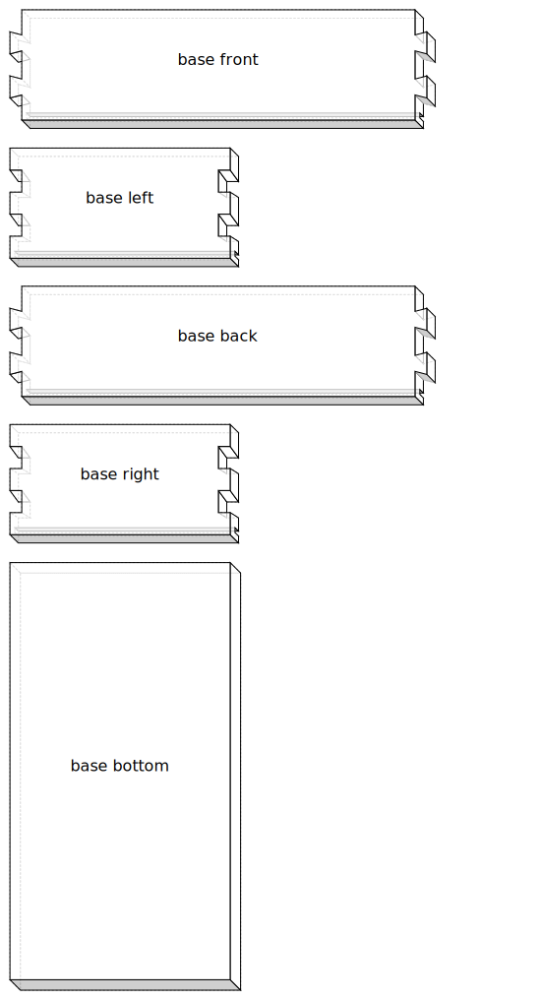
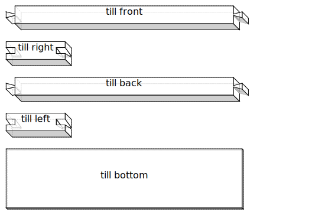
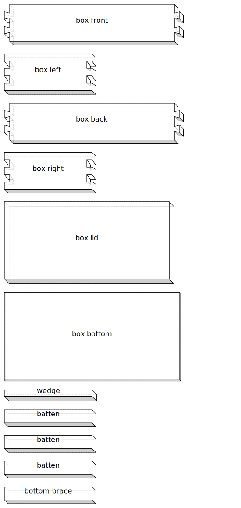
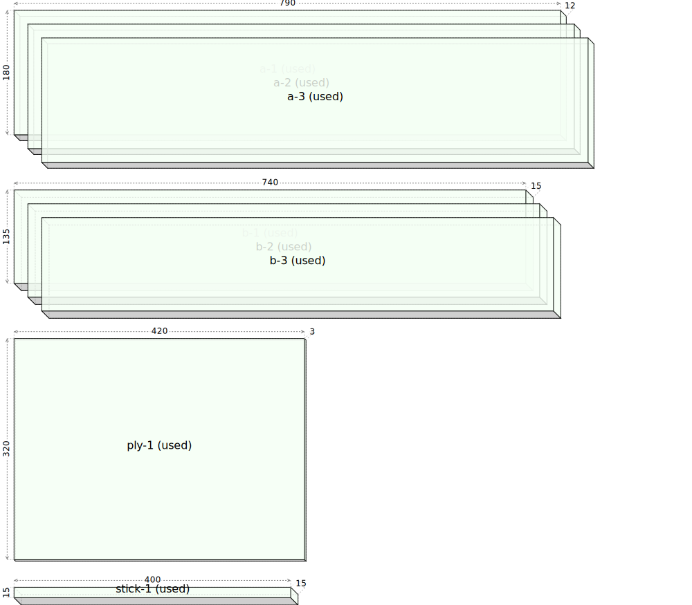
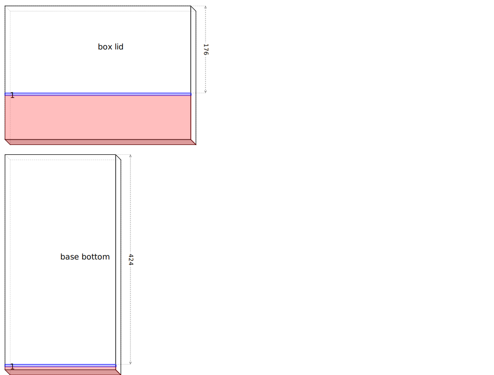

# Art supply tote box

## References

John Zhu scrap bin challenge toolbox

https://youtu.be/pxa88seXsNc?si=2QYJmRWRqUD6E20g&t=567

The box is 290 X 180 mm and 55 deep. Two levels would fit all but 5 of my paint tubes.

          

## Design
- 360 or 400 mm long?
- 200mm wide inside
- 55-60mm deep inside
- can't be too heavy
  - plywood for drawer bottoms
  - solid bottom for base
  - solid lid for box
  - plywood bottom for box

Not sure that the drawer is very useful, wouldn't be long enough for brushes etc.

might be better to have a long shallow(ish) removable till for brushes and small items

          
## Base
- 60mm for tubes + 30mm for till + 10mm inset for box --> 100m inside depth

## Till
- 30mm deep, 1/2 width

## Handle
not too high, but has to have room to easily remove box
## Removable box
- 60mm deep inside

## Stock

- 3 x 790 x 180 x 12 (10mm moulded)

- 3 x 740 x 135 x 15 (excluding groove)

- 2 x 390 x 185 x 15 (10mm mouldings)
- 3 x 400 x 165 x 19 (20mm bevels)
- 1 x 750 x 45 x 12
- 2 x 720 x 65 x 19 (60x8 mortice at 150,10)

          

## Cut list

## Jointing

