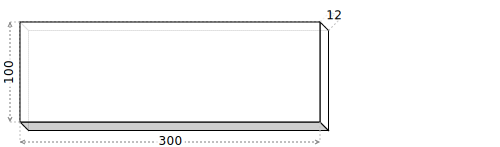
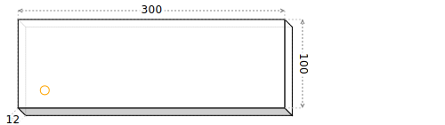
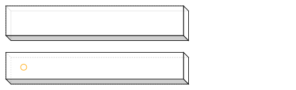
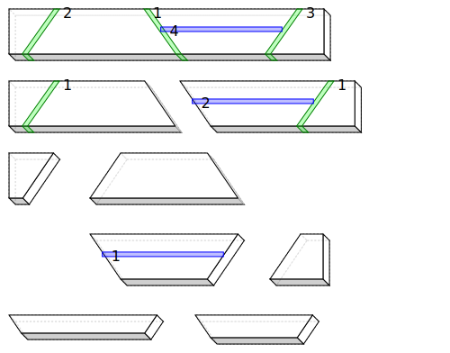
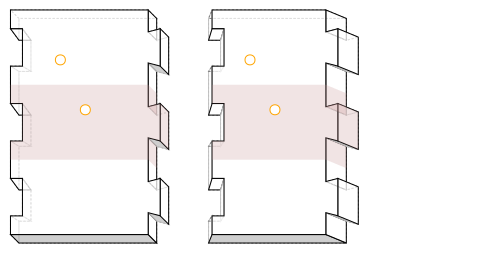
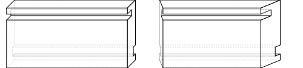
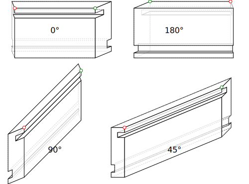

# Basic Operations
## Stock
create a simple board
 - length 300.0
 - area 30000
 - aspect 3.0

mark any defects

rip cut

cross cut

cut list on original board

joint

mitre

dovetails

dovetails (from above)

grooves

grooves (from above)

rotation

rotation (from above)

plan view

front view

side view

