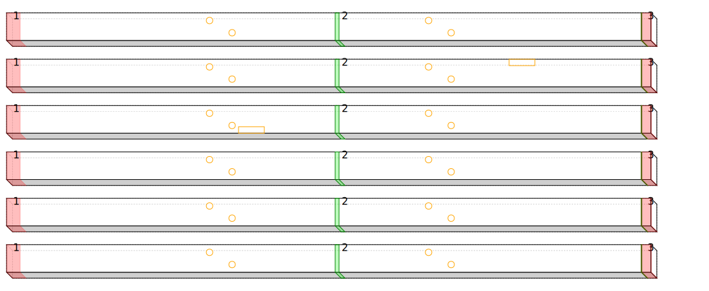
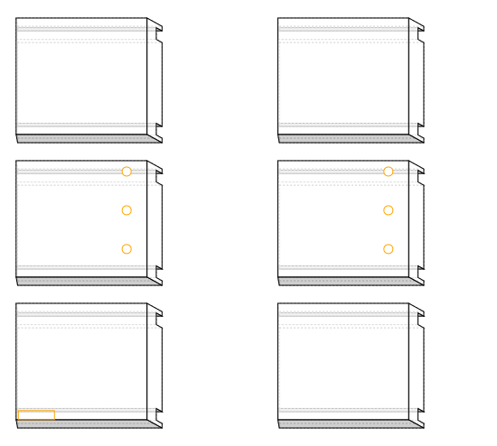
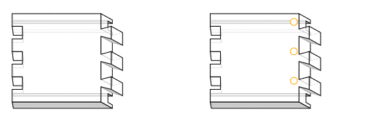
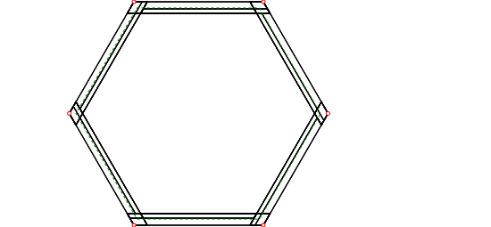
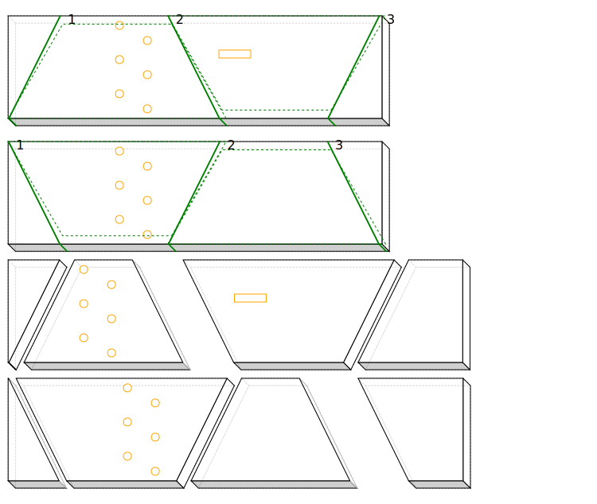
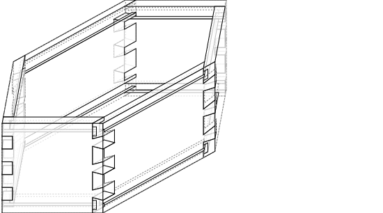

# Hexagonal box
## Stock
6 boards 1000 x 43 x 13, trim 20 from each end, cut at 490

## Join panels
4 panels from 3 boards
- 470 x 129 x 13
- 470 x 129 x 13
- 490 x 129 x 13
- 490 x 129 x 13

## Cut grooves
- grooves for top and bottom
- 13mm groove 5mm from top and bottom edges
- groove on inside with defects/holes
## Cut sides
- 6 sides 160 x 129 x 13
- mitre at 60 degrees
- outside edge is 15mm shorter
- defects/holes and groove go on longer side (inside)

## Dovetails
- 2 tails
- mitre over groove
- each side has tails at one end, pins at the other
- baseline is 15.0 from end

## Sides

- Final width = 290.0, Final height = 251.1
- Inside length = 160.0, Outside length = 145.0
## Base and Lid
- Cut base and lid out of boards in 2 halves and join
- rebates so groove for base can be smaller?
   - better to just plane thickness down to 10mm
- lid/base width 237.3, side length 137.0

## Final box

