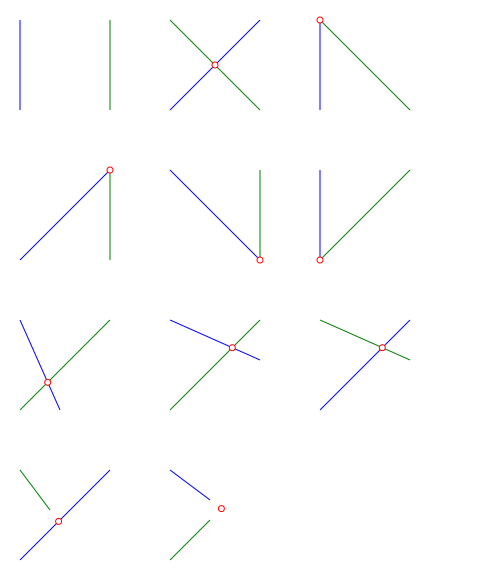
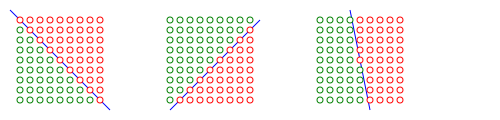
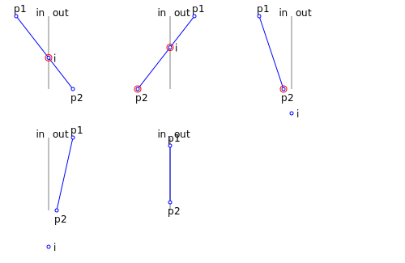
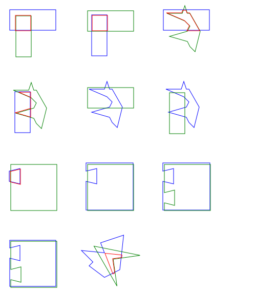
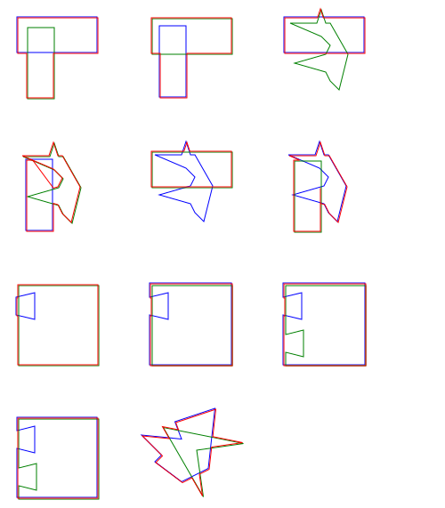
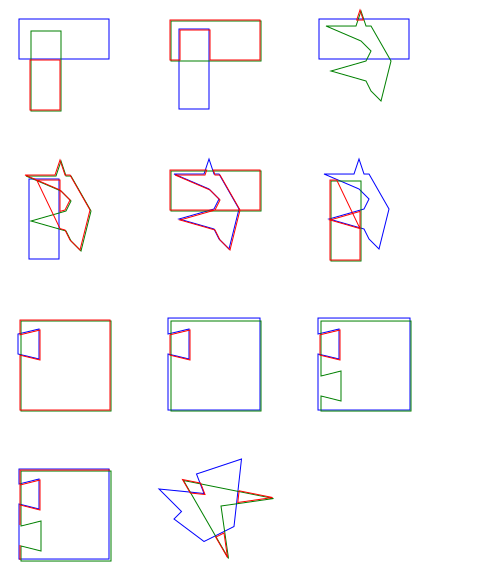
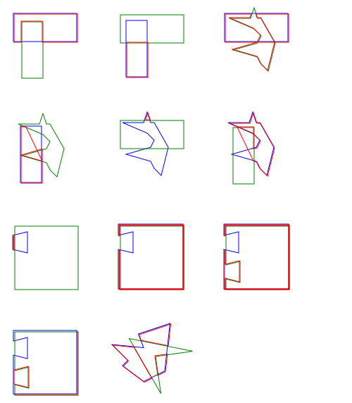
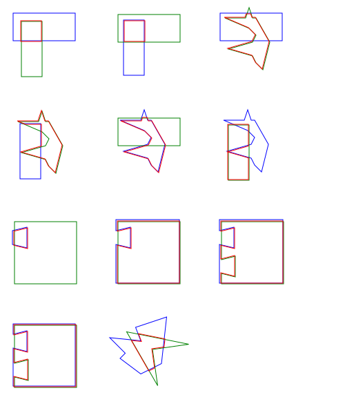
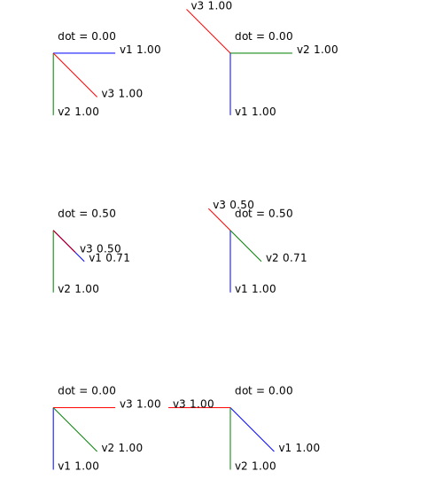

# Geometry test

## line_intersection

## is_inside

## test for sutherland-hodgman

## clip_polygon (sutherland-hodgman)
this fails when the clip polygon is not convex

## clip_polygon2 - union (Greiner and Hormann)

## clip_polygon2 - difference (Greiner and Hormann)
this is now the simplest, but clip polygon still can't be coincident...

## clip_polygon2 - reversed-diff (Greiner and Hormann)

## clip_polygon2 - intersection (Greiner and Hormann)
polygons can't be coincident, so make clip region a little larger and it works

## dot product, cross product
(1, 0, 0) x (0, 1, 0) = (0, 0, 1)

(0, 1, 0) x (1, 0, 0) = (0, 0, -1)

(0.5, 0.5, 0) x (0, 1, 0) = (0.0, 0.0, 0.5)

(0, 1, 0) x (0.5, 0.5, 0) = (0.0, 0.0, -0.5)

(0, 1, 0) x (0, 0, 1) = (1, 0, 0)

(0, 0, 1) x (0, 1, 0) = (-1, 0, 0)

